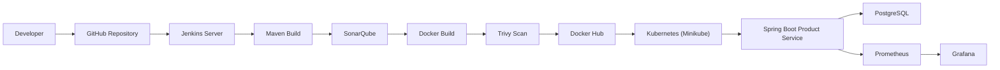
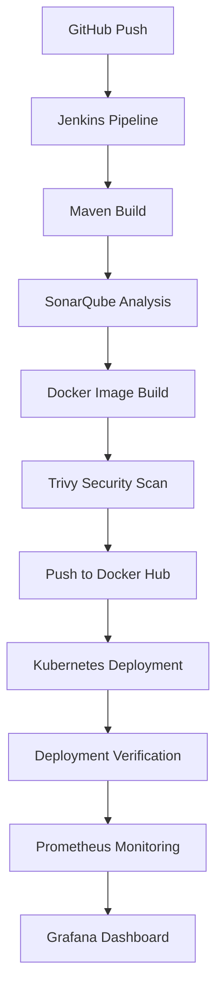
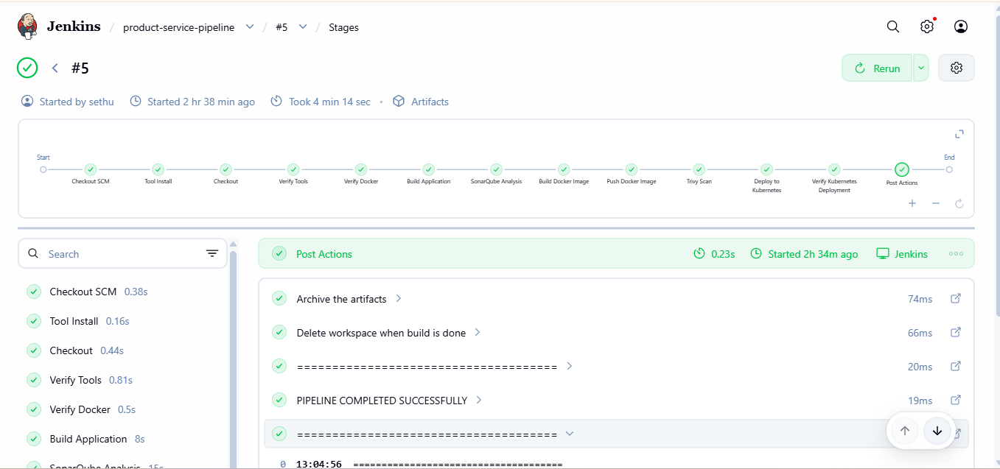
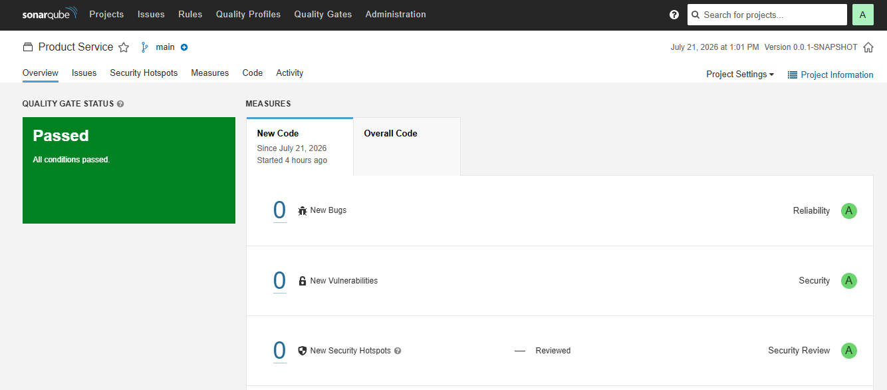
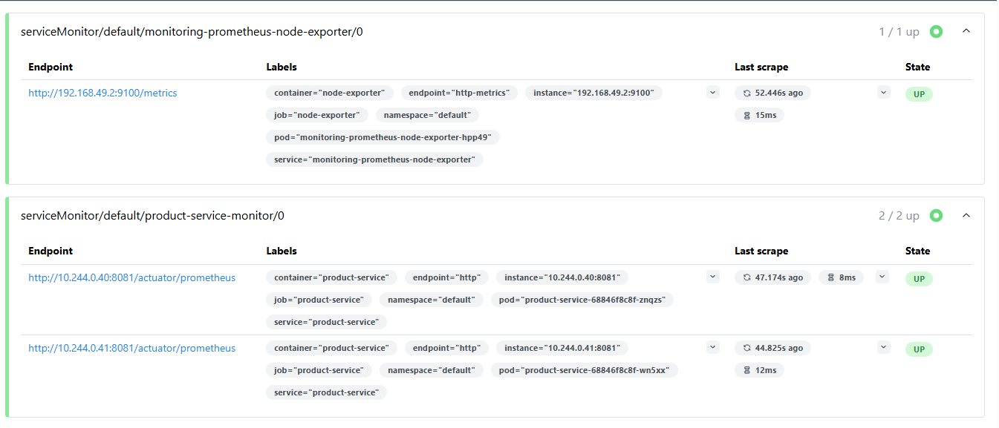
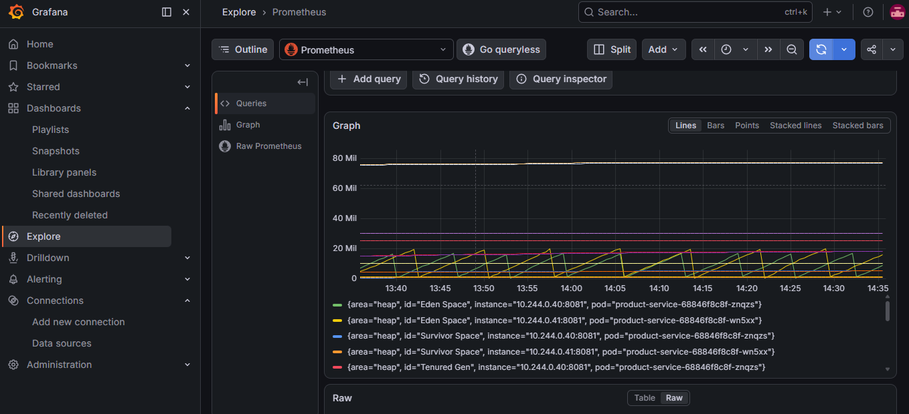

# 🚀 Spring Boot CI/CD Pipeline with Kubernetes Monitoring


---

# 📖 Project Overview

This project demonstrates a complete **DevOps CI/CD pipeline** for a **Spring Boot Product Service** deployed on **Kubernetes (Minikube)** running on **AWS EC2**.

The pipeline automates:

* Source Code Management
* Build Automation
* Code Quality Analysis
* Security Scanning
* Docker Image Creation
* Docker Hub Publishing
* Kubernetes Deployment
* Deployment Verification
* Monitoring using Prometheus & Grafana

---

# 🏗 System Architecture



---

# 🔄 CI/CD Workflow



---

# 🛠 Technology Stack

| Category         | Technology            |
| ---------------- | --------------------- |
| Cloud            | AWS EC2               |
| SCM              | Git & GitHub          |
| CI/CD            | Jenkins               |
| Build Tool       | Maven                 |
| Language         | Java 21               |
| Framework        | Spring Boot           |
| Database         | PostgreSQL            |
| Containerization | Docker                |
| Image Registry   | Docker Hub            |
| Orchestration    | Kubernetes (Minikube) |
| Code Quality     | SonarQube             |
| Security         | Trivy                 |
| Monitoring       | Prometheus            |
| Dashboard        | Grafana               |

---

# ✨ Features

* Automated Jenkins Pipeline
* Maven Build Automation
* SonarQube Code Analysis
* Docker Image Creation
* Docker Hub Image Publishing
* Trivy Vulnerability Scanning
* Kubernetes Deployment
* Automatic Rollback
* Deployment Verification
* Prometheus Monitoring
* Grafana Dashboards
* Spring Boot Actuator Metrics
* Workspace Cleanup
* Build Artifact Archiving

---

# 📂 Project Structure

```text
product-service/
├── src/
├── k8s/
│   ├── deployment.yaml
│   ├── service.yaml
│   ├── configmap.yaml
│   ├── secret.yaml
│   └── servicemonitor.yaml
├── Dockerfile
├── Jenkinsfile
├── pom.xml
├── README.md
└── images/
    ├── jenkins-success.png
    ├── sonarqube.png
    ├── prometheus.png
    ├── grafana.png
```

---

# ⚙️ Prerequisites

Before running this project, install:

* Java 21
* Maven
* Git
* Docker
* Jenkins
* SonarQube
* Trivy
* Minikube
* kubectl
* PostgreSQL

---

# 🚀 Pipeline Stages

```
Checkout Source Code
        ↓
Verify Tools
        ↓
Verify Docker
        ↓
Build Spring Boot Application
        ↓
SonarQube Code Analysis
        ↓
Build Docker Image
        ↓
Trivy Security Scan
        ↓
Push Image to Docker Hub
        ↓
Deploy to Kubernetes
        ↓
Verify Rollout
        ↓
Deployment Verification
        ↓
Archive Reports
        ↓
Workspace Cleanup
```

---

# 🚀 Deployment Steps

```bash
# Clone Repository
git clone https://github.com/sethuraman-17/product-service.git
# Build Application
mvn clean package

# Build Docker Image
docker build -t product-service .

# Push Image
docker push sethu1705/product-service

# Deploy to Kubernetes
kubectl apply -f k8s/

# Verify Deployment
kubectl get deployments
kubectl get pods
kubectl get svc
```

---

# 📊 Monitoring

The application exposes Spring Boot Actuator metrics.

Monitoring flow:

```
Spring Boot
      ↓
Actuator Metrics
      ↓
Prometheus
      ↓
Grafana Dashboard
```

---

# 📸 Screenshots

## Jenkins Pipeline



---

## SonarQube Dashboard



---

## Prometheus Dashboard



---

## Grafana Dashboard



---

# 🔍 Useful Kubernetes Commands

```bash
kubectl get deployments

kubectl get pods

kubectl get svc

kubectl get rs

kubectl rollout history deployment/product-service

kubectl rollout status deployment/product-service

kubectl describe deployment product-service

kubectl logs deployment/product-service
```

---

# ⚠️ Challenges Faced

* Fixed ImagePullBackOff by correcting Docker image tags.
* Resolved CrashLoopBackOff caused by PostgreSQL connectivity.
* Configured Kubernetes Secrets and ConfigMaps.
* Integrated SonarQube with Jenkins.
* Configured Trivy image scanning.
* Implemented automatic rollback during deployment failures.
* Configured ServiceMonitor for Prometheus metrics collection.
* Exposed Grafana and Prometheus dashboards.

---

# 📈 Results

* Automated CI/CD Pipeline
* Secure Container Deployment
* Continuous Code Quality Analysis
* Automated Vulnerability Scanning
* Kubernetes Orchestration
* Zero Manual Deployment
* Automatic Rollback
* Real-time Monitoring
* Production-style DevOps Workflow

---

# 🔮 Future Enhancements

* Multi-environment deployment (Dev, QA, Production)
* Helm Charts
* Argo CD GitOps Deployment
* Slack Notifications
* Email Notifications
* JUnit Test Reports
* JaCoCo Code Coverage
* Semantic Versioning
* Blue-Green Deployment
* Canary Deployment

---

# 👨‍💻 Author

## **Sethuraman S**

**DevOps & Cloud Engineer**

**Skills**

* AWS EC2
* Jenkins
* Docker
* Kubernetes
* Spring Boot
* Java
* Maven
* SonarQube
* Trivy
* Prometheus
* Grafana
* PostgreSQL
* Git & GitHub

---

⭐ If you found this project useful, consider giving it a **Star** on GitHub.
